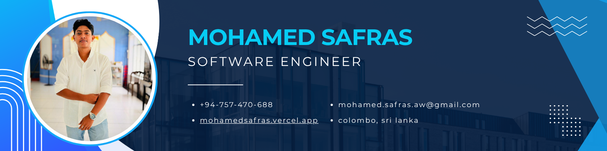

<h1 align="center">Hey Everyone 👋, I'm Mohamed Safras</h1>

  

 A passionate Software Engineer based in Colombo, Sri Lanka. I work in the corporate IT sector and building high perfomance software products

  
  
  

---

### 🧠 About Me

- 🔭 Software Engineer at **Acentura Inc.** — 3 years of experience across backend engineering and AI/LLM development
- 🤖 Working on **RAG systems, LangChain, LangGraph, vector search, and LLM-powered tooling**
- ⚙️ Comfortable across the stack — APIs, data pipelines, system design, and integrations
- 🌍 Open to remote and international software engineering opportunities
- 📫 Reach me at **mohamed.safras.aw@gmail.com**

---

### 🛠️ Tech Stack

**Languages**  

**Backend & APIs**  

**AI / LLM**  

**Databases**  

**Tools & Cloud**  

---

### 📊 GitHub Stats

  
  

  

---

  <i>Open to backend, AI/LLM, and full-stack engineering roles — remote or relocation.</i>

